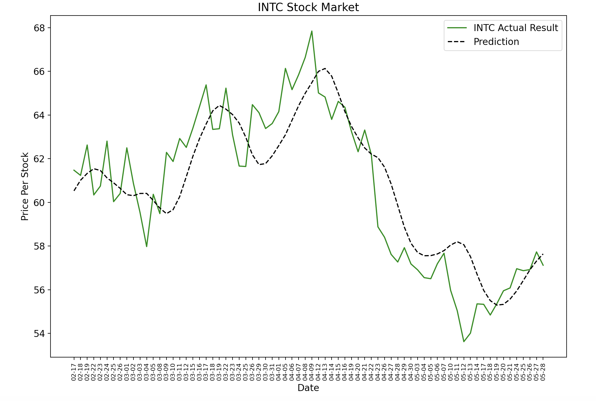

# Stock-Market-Visualization


## **Output Demo**



This is a project utilized neural network model [Long short-term memory](https://en.wikipedia.org/wiki/Long_short-term_memory)
to predict stock prices based on the data from the past days. I used matplotlib to plot the real data
and the prediction data. This project serves as a learning material to let me familiarize with
neural network and matplotlib.

## **Disclaimer**
This project is solely used for learning neural network model. This shouldn't be a basis
for anyone to used to trade in the real market. I hold no responsibility
for any trading based on this project.

## **Dependencies**
* [MatplotLib](https://pypi.org/project/matplotlib/)
* [Numpy](https://pypi.org/project/numpy/)
* [Pandas-DataReader](https://pandas-datareader.readthedocs.io/en/latest/) 
* [Sklearn](https://pypi.org/project/scikit-learn/)
* [Tensorflow](https://pypi.org/project/tensorflow/)

## **Installation**
```console
$ pip install matplotlib
$ pip install numpy
$ pip install pandas-datareader
$ pip install scikit-learn
$ pip install tensorflow
```

## **Contact**
For any bugs and advices, contact me at
**yaowenc2@illinois.edu**.

## **Licence**
Released under the [MIT License](https://github.com/jonschlinkert/update-copyright/blob/master/LICENSE).


